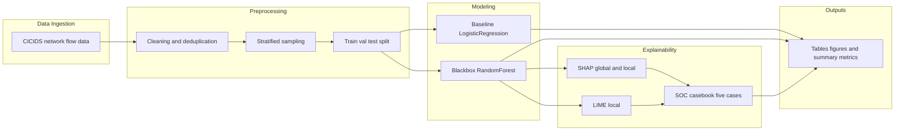

# SEHS5052 Group Project Report  
## Topic E: Explainable AI (XAI) for SOC Decision Support

---

## Cover Page Information (for final PDF)

- **Course:** SEHS5052 AI-driven Cybersecurity Management  
- **Topic:** Topic E — Explainable AI (XAI) for Security Operations Centre Decision Support  
- **Google Colab Link (Viewer):** [SEHS5052_Group Project_Group10.ipynb](https://drive.google.com/file/d/19vEltqTcCUo41ROCJEFT-MbA2pFrHumb/view?usp=sharing)  

---

## Executive Summary

This project builds an intrusion-detection decision-support workflow for SOC analysts using CICIDS-2017.  
Two supervised models are implemented: a baseline Logistic Regression model and a black-box Random Forest model.  
To address accountability and trust requirements in Topic E, the project integrates SHAP and LIME to provide global and case-level explanations, and generates a SOC alert report for five representative cases (including TP, FP, and FN).  

Using the current notebook-aligned run configuration (`max_rows=30000`, `sample_size=12000`, `rf_n_estimators=120`, `rf_max_depth=20`), the workflow achieves near-perfect metrics on the held-out split while preserving TP/FP/FN case coverage for analyst-oriented interpretation.

---

## 1. Sector Scenario, Threat Landscape, and System Architecture

### 1.1 Sector Context and Critical Assets

The target deployment context is an enterprise or telecommunications SOC handling high-volume network telemetry.  
Key assets include:

- network flow records and session metadata,
- endpoint and service identities,
- alert triage queues and case-management records,
- analyst time and operational response capacity.

In this context, **false positives** increase alert fatigue and triage overhead, while **false negatives** can extend attacker dwell time and increase breach impact.

### 1.2 Threat Actors and Attack Surface

Primary threat actors include opportunistic external attackers, targeted intruders, and compromised internal hosts.  
Relevant attack patterns (aligned with CICIDS traffic semantics) include DDoS-like bursts, scanning behavior, and suspicious flow timing/length profiles.

### 1.3 CIA and AAA Mapping

| Security Dimension | SOC Relevance |
|---|---|
| **Confidentiality** | FN cases may allow hidden exfiltration or unauthorized data access. |
| **Integrity** | Malicious flow manipulation can distort traffic behavior and evade static rules. |
| **Availability** | DoS patterns directly degrade service availability and SOC response performance. |

| Governance Dimension | SOC Relevance |
|---|---|
| **Authentication** | Endpoint identity signals help contextualize suspicious sessions. |
| **Authorization** | Misclassification may trigger incorrect blocking decisions. |
| **Accounting** | Explanations and scores support audit trails and post-incident reviews. |

### 1.4 Research Question

Can a Random Forest intrusion detector, augmented with SHAP and LIME explanations, improve SOC decision transparency by:

1. exposing features that drive FP decisions,  
2. producing interpretable TP/FP/FN case evidence, and  
3. maintaining stable train/validation/test behavior for operational deployment?

### 1.5 System Architecture



Implementation entry point: the project's end-to-end experiment runner.

---

## 2. Dataset Description and Preprocessing

### 2.1 Dataset Profile

| Item | Value |
|---|---|
| Dataset | CICIDS-2017 |
| Source | [https://www.unb.ca/cic/datasets/ids-2017.html](https://www.unb.ca/cic/datasets/ids-2017.html) |
| Input subset in this run | Friday afternoon traffic segment from CICIDS-2017 |
| Rows after cleaning + sampling | 12,000 |
| Raw feature columns (pre-one-hot) | 84 |

Class distribution (from the current notebook-aligned outputs):

| Class | Count |
|---|---:|
| Benign (0) | 8,044 |
| Attack (1) | 3,956 |

### 2.2 Preprocessing Pipeline

The preprocessing flow is implemented in the project's data and model modules:

1. label normalization to binary target (`unify_binary_labels`),  
2. `inf/-inf` to `NaN`, high-missing-column drop, duplicate removal (`basic_cleaning`),  
3. stratified sampling once for fair model comparison (`sample_dataset_bundle`),  
4. stratified train/validation/test split (`split_train_val_test`),  
5. model preprocessor with median/most-frequent imputation, scaling, and one-hot encoding (`ColumnTransformer`),  
6. class-imbalance handling via `class_weight`,  
7. threshold selection on validation probabilities by F1 maximization.

### 2.3 Exploratory Data Analysis

**Figure 1. Class Distribution**


**Figure 2. Correlation Heatmap (Top 20 Numeric Features)**  
Correlation is computed on up to 10,000 sampled rows when data is larger.


---

## 3. AI Model Design and Python Implementation

### 3.1 Baseline Model

The baseline model is Logistic Regression with balanced class weights and the same preprocessing stack as the black-box model.  
This provides a transparent linear reference model [4].

Key implementation snippet (preprocessing pipeline):

```python
numeric_pipe = Pipeline(
    steps=[("imputer", SimpleImputer(strategy="median")),
           ("scaler", StandardScaler())]
)
categorical_pipe = Pipeline(
    steps=[("imputer", SimpleImputer(strategy="most_frequent")),
           ("onehot", OneHotEncoder(handle_unknown="ignore"))]
)
preprocessor = ColumnTransformer(
    transformers=[("num", numeric_pipe, numeric_cols),
                  ("cat", categorical_pipe, categorical_cols)]
)
```

### 3.2 Black-Box Model

The advanced model is Random Forest (`n_estimators=120`, `max_depth=20`, `min_samples_leaf=2`) with balanced subsampling.  
The model is selected because:

- it captures non-linear feature interactions in tabular intrusion data [4],
- it supports SHAP TreeExplainer efficiently for tree-based models [1],
- it provides strong practical performance with limited tuning in SOC-style tabular detection workflows [4].

Key implementation snippet (model training + threshold selection):

```python
model = RandomForestClassifier(
    n_estimators=120,
    max_depth=20,
    min_samples_leaf=2,
    class_weight="balanced_subsample",
    random_state=42,
    n_jobs=-1,
)
pipe = Pipeline(steps=[("preprocessor", preprocessor), ("model", model)])
pipe.fit(X_train, y_train)
val_prob = pipe.predict_proba(X_val)[:, 1]
threshold = select_threshold_by_f1(y_val, val_prob)
```

### 3.3 Explainability Design (Topic E Core Requirement)

Implemented in the explainability module [1], [2]:

- **SHAP global:** feature importance by mean absolute SHAP values,  
- **SHAP local:** per-case contribution vectors and waterfall plots,  
- **LIME local:** rule-like local explanations for the same selected case IDs.

Key implementation snippet (SHAP global/local):

```python
explainer = shap.TreeExplainer(model)
shap_values_global = explainer.shap_values(X_global)
mean_abs = np.mean(np.abs(shap_values_global), axis=0)
shap_global = pd.DataFrame(
    {"feature": feature_names, "mean_abs_shap": mean_abs}
).sort_values("mean_abs_shap", ascending=False)
```

### 3.4 SOC Casebook Construction

Implemented in the SOC simulation module:

- enforce TP/FP/FN coverage using threshold search (`choose_required_soc_cases`),  
- build a 5-case analyst-facing report (`build_soc_alert_report`),  
- generate SHAP-vs-LIME comparison table and analyst utility metrics.

Key implementation snippet (TP/FP/FN-aware case selection):

```python
case_ids, forced_case_types, case_thresholds, case_presence = choose_required_soc_cases(
    y_true=y_test.reset_index(drop=True),
    y_prob=blackbox_probs,
    default_threshold=blackbox.threshold,
    max_cases=5,
)
```

---

## 4. Evaluation and Topic-Specific Advanced Analysis

### 4.1 Comparative Performance (Test Set)

Source: model evaluation outputs from the current notebook-aligned run.

| Model | Accuracy | Precision | Recall | F1 | ROC-AUC |
|---|---:|---:|---:|---:|---:|
| Logistic Regression (baseline) | 1.00000 | 1.00000 | 1.00000 | 1.00000 | 1.00000 |
| Random Forest (black-box) | 0.99833 | 0.99497 | 1.00000 | 0.99748 | 1.00000 |

### 4.2 Confusion Matrix Analysis

**Figure 3. Baseline Confusion Matrix**


**Figure 4. Black-Box Confusion Matrix**


Security interpretation:

- **FP impact:** analyst overload, potential business disruption from unnecessary response.  
- **FN impact:** delayed containment and increased compromise dwell time.

### 4.3 SHAP and LIME Analysis

**Figure 5. SHAP Summary Plot**


Representative top global features from the SHAP importance outputs include [1]:

- `cat__ Destination IP_192.168.10.50`,  
- `num__ Avg Fwd Segment Size`,  
- `num__ Fwd IAT Std`,  
- `num__ Packet Length Variance`.

### 4.4 Local Explanation Case Studies (5 SOC Cases)

**Figure 6. SHAP Waterfall (sample_id=0, TP)**  


**Figure 7. SHAP Waterfall (sample_id=103, FP)**  


**Figure 8. SHAP Waterfall (sample_id=514, FN)**  


**Figure 9. SHAP Waterfall (sample_id=1, TN)**  


**Figure 10. SHAP Waterfall (sample_id=3, TP)**  


FP interpretation example (sample_id=103): key local SHAP drivers include endpoint identity and packet-length-related signals, while LIME emphasizes sparse rule-form one-hot conditions [2]. This mismatch should be disclosed as a method-level representation gap, not a contradiction in model logic.

### 4.5 SHAP-LIME Agreement and Analyst Utility

From the run-level summary outputs:

| Metric | Value |
|---|---:|
| ExplanationCoverage | 1.0 |
| TopKAgreement | 0.0 |
| ActionabilityScore | 0.8 |
| FPReviewEfficiency | 0.4 |

The current TopKAgreement is low because SHAP uses transformed feature names while LIME outputs rule strings, so direct lexical overlap is limited [1], [2].

### 4.5.1 Feature-Importance Bias (Topic E-specific)

A key Topic E risk is feature-importance bias: high-ranking predictors may reflect environment-specific identifiers (e.g., endpoint/IP one-hot features) rather than stable attack semantics [1], [2]. In this run, identity-heavy features appear in local and global explanations, which can inflate apparent performance under similar network conditions but reduce portability across organizations. Operationally, this may over-prioritize alerts tied to known infrastructure patterns while under-explaining novel attack paths. To mitigate this, feature governance should include periodic review of explanation rankings, ablation checks for identity-dominant features, and re-training under drift-aware validation splits.

### 4.6 Overfitting Diagnostics

Source: overfitting diagnostic outputs from the current notebook-aligned run.

| Model | Split | F1 |
|---|---|---:|
| baseline | train | 0.99928 |
| baseline | val | 1.00000 |
| baseline | test | 1.00000 |
| blackbox | train | 0.99766 |
| blackbox | val | 0.99916 |
| blackbox | test | 0.99748 |

**Figure 11. F1 by Split**


Observed split gaps are small, but the report should explicitly note that train/val/test all come from closely related distribution slices, which can overestimate production generalization.

---

## 5. Organisational Deployment Strategy, Ethics, and Future Work

### 5.1 Deployment Strategy

Suggested deployment architecture:

1. ingest flow telemetry into SIEM/SOAR pipeline,  
2. run scoring service with fixed model version and threshold,  
3. enrich high-risk alerts with SHAP/LIME evidence and casebook recommendations,  
4. apply human-in-the-loop triage for suppression/escalation decisions.

### 5.2 Key Limitations

1. **Adversarial exposure risk:** explanation surfaces can be exploited for evasion crafting.  
2. **Concept drift risk:** CICIDS static snapshots may not represent evolving enterprise traffic.  
3. **Representation mismatch:** SHAP and LIME output formats limit direct comparability.  
4. **Identity-heavy features:** one-hot endpoint features may reduce portability and raise privacy concerns.

### 5.3 Ethics and Compliance

| Compliance dimension | GDPR-style requirement | HIPAA-style requirement | Project control mapping |
|---|---|---|---|
| Lawfulness and purpose limitation | Data processing must have a lawful basis and clearly defined security purpose [5]. | Use/disclosure must be limited to permitted security operations under administrative safeguards [6]. | Restrict model inputs to SOC detection scope; avoid repurposing data for unrelated analytics. |
| Data minimization and access control | Minimize personal data and restrict processing to necessary attributes [5]. | Apply minimum necessary access and role-based controls for ePHI-related telemetry [6]. | Keep only flow/security-relevant fields; enforce analyst RBAC in SOC tooling. |
| Transparency, accountability, and auditability | Maintain accountable processing records and explainability for decisions affecting individuals [5]. | Maintain auditable security procedures and incident documentation [6]. | Retain model version, threshold, SHAP/LIME evidence, and case decisions for audit trails. |
| Human oversight and risk management | Support human review for consequential automated decisions [5]. | Require operational safeguards and supervised incident response workflows [6]. | Enforce analyst-in-the-loop triage before blocking/escalation actions. |

### 5.4 Future Work

1. add temporal split and drift monitoring for stronger operational validity,  
2. build feature-semantic mapping layer to harmonize SHAP and LIME for analyst reporting,  
3. evaluate low-latency explanation strategies for near-real-time SOC use.

---

## References

[1] S. M. Lundberg and S.-I. Lee, "A Unified Approach to Interpreting Model Predictions," in *Proc. NeurIPS*, 2017.

[2] M. T. Ribeiro, S. Singh, and C. Guestrin, "Why Should I Trust You? Explaining the Predictions of Any Classifier," in *Proc. ACM SIGKDD*, 2016, pp. 1135-1144.

[3] Canadian Institute for Cybersecurity, "CICIDS2017 Dataset," University of New Brunswick. [Online]. Available: https://www.unb.ca/cic/datasets/ids-2017.html. [Accessed: Apr. 18, 2026].

[4] F. Pedregosa *et al*., "Scikit-learn: Machine Learning in Python," *Journal of Machine Learning Research*, vol. 12, pp. 2825-2830, 2011.

[5] European Parliament and Council of the European Union, "Regulation (EU) 2016/679 (General Data Protection Regulation)," Apr. 2016. [Online]. Available: https://eur-lex.europa.eu/eli/reg/2016/679/oj. [Accessed: Apr. 18, 2026].

[6] U.S. Department of Health and Human Services, "HIPAA Security Rule (45 CFR Part 160 and Subparts A and C of Part 164)." [Online]. Available: https://www.hhs.gov/hipaa/for-professionals/security/index.html. [Accessed: Apr. 18, 2026].

