# SEHS5052 Group Project Report  
## Topic E: Explainable AI (XAI) for SOC Decision Support

---

## Cover Page Information (for final PDF)

- **Course:** SEHS5052 AI-driven Cybersecurity Management  
- **Topic:** Topic E — Explainable AI (XAI) for Security Operations Centre Decision Support  
- **Group Members:** `Name - Student ID` (fill for all members)  
- **Google Colab Link (Viewer):** `REPLACE_WITH_PUBLIC_COLAB_LINK`  
- **Submission note:** verify the Colab link opens in private/incognito mode without sign-in.

---

## Executive Summary

This project builds an intrusion-detection decision-support workflow for SOC analysts using CICIDS-2017.  
Two supervised models are implemented: a baseline Logistic Regression model and a black-box Random Forest model.  
To address accountability and trust requirements in Topic E, the project integrates SHAP and LIME to provide global and case-level explanations, and generates a SOC alert report for five representative cases (including TP, FP, and FN).  

Using a frozen run configuration (`max_rows=80000`, `sample_size=30000`, `rf_n_estimators=80`, `rf_max_depth=16`), the workflow achieves near-perfect metrics on the held-out split while preserving TP/FP/FN case coverage for analyst-oriented interpretation.

---

## 1. Sector Scenario, Threat Landscape, and System Architecture

### 1.1 Sector Context and Critical Assets

The target deployment context is an enterprise or telecommunications SOC handling high-volume network telemetry.  
Key assets include:

- network flow records and session metadata,
- endpoint and service identities,
- alert triage queues and case-management records,
- analyst time and operational response capacity.

In this context, **false positives** increase alert fatigue and triage overhead, while **false negatives** can extend attacker dwell time and increase breach impact.

### 1.2 Threat Actors and Attack Surface

Primary threat actors include opportunistic external attackers, targeted intruders, and compromised internal hosts.  
Relevant attack patterns (aligned with CICIDS traffic semantics) include DDoS-like bursts, scanning behavior, and suspicious flow timing/length profiles.

### 1.3 CIA and AAA Mapping

| Security Dimension | SOC Relevance |
|---|---|
| **Confidentiality** | FN cases may allow hidden exfiltration or unauthorized data access. |
| **Integrity** | Malicious flow manipulation can distort traffic behavior and evade static rules. |
| **Availability** | DoS patterns directly degrade service availability and SOC response performance. |

| Governance Dimension | SOC Relevance |
|---|---|
| **Authentication** | Endpoint identity signals help contextualize suspicious sessions. |
| **Authorization** | Misclassification may trigger incorrect blocking decisions. |
| **Accounting** | Explanations and scores support audit trails and post-incident reviews. |

### 1.4 Research Question

Can a Random Forest intrusion detector, augmented with SHAP and LIME explanations, improve SOC decision transparency by:

1. exposing features that drive FP decisions,  
2. producing interpretable TP/FP/FN case evidence, and  
3. maintaining stable train/validation/test behavior for operational deployment?

### 1.5 System Architecture

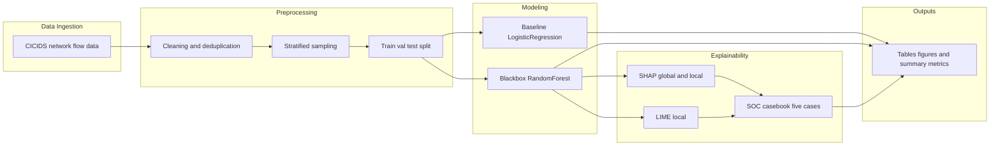

Implementation entry point: the project's end-to-end experiment runner.

---

## 2. Dataset Description and Preprocessing

### 2.1 Dataset Profile

| Item | Value |
|---|---|
| Dataset | CICIDS-2017 |
| Source | [https://www.unb.ca/cic/datasets/ids-2017.html](https://www.unb.ca/cic/datasets/ids-2017.html) |
| Input subset in this run | Friday afternoon traffic segment from CICIDS-2017 |
| Rows after cleaning + sampling | 30,000 |
| Raw feature columns (pre-one-hot) | 84 |

Class distribution (from the frozen experiment outputs):

| Class | Count |
|---|---:|
| Benign (0) | 13,148 |
| Attack (1) | 16,852 |

### 2.2 Preprocessing Pipeline

The preprocessing flow is implemented in the project's data and model modules:

1. label normalization to binary target (`unify_binary_labels`),  
2. `inf/-inf` to `NaN`, high-missing-column drop, duplicate removal (`basic_cleaning`),  
3. stratified sampling once for fair model comparison (`sample_dataset_bundle`),  
4. stratified train/validation/test split (`split_train_val_test`),  
5. model preprocessor with median/most-frequent imputation, scaling, and one-hot encoding (`ColumnTransformer`),  
6. class-imbalance handling via `class_weight`,  
7. threshold selection on validation probabilities by F1 maximization.

### 2.3 Exploratory Data Analysis

**Figure 1. Class Distribution**

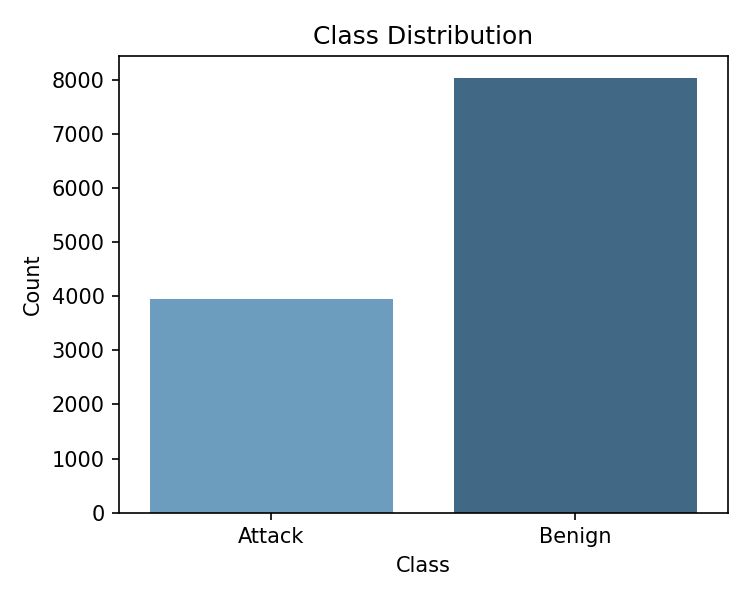

**Figure 2. Correlation Heatmap (Top 20 Numeric Features)**  
Correlation is computed on up to 10,000 sampled rows when data is larger.

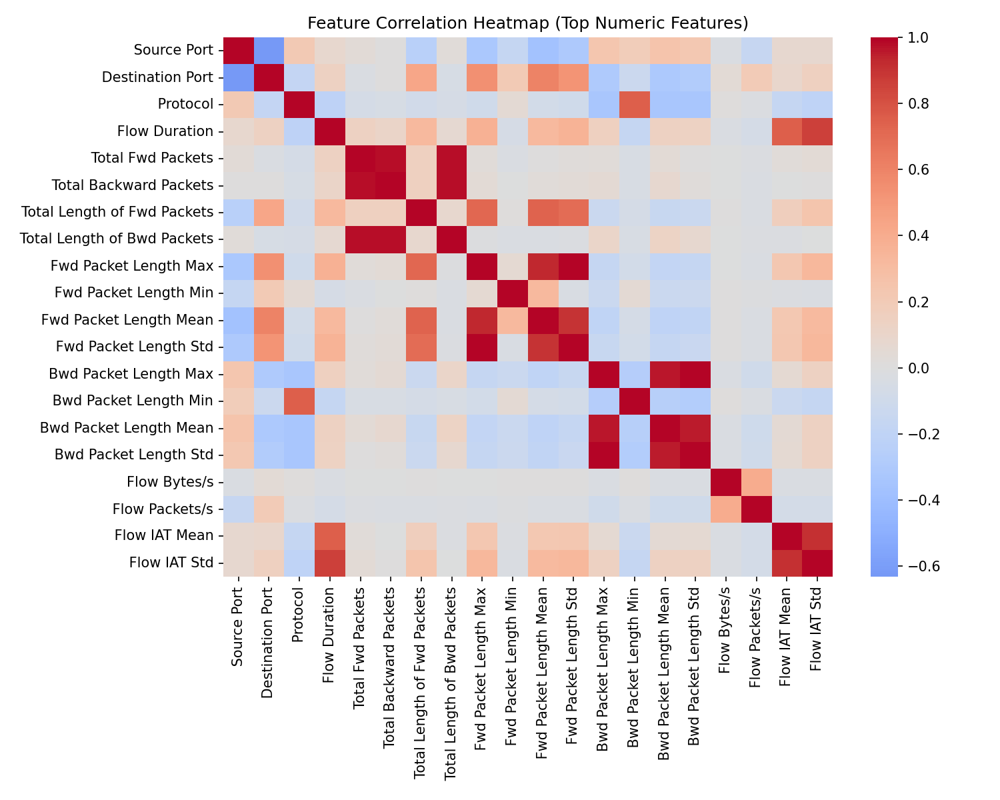

---

## 3. AI Model Design and Python Implementation

### 3.1 Baseline Model

The baseline model is Logistic Regression with balanced class weights and the same preprocessing stack as the black-box model.  
This provides a transparent linear reference model.

### 3.2 Black-Box Model

The advanced model is Random Forest (`n_estimators=80`, `max_depth=16`, `min_samples_leaf=2`) with balanced subsampling.  
The model is selected because:

- it captures non-linear feature interactions in tabular intrusion data,
- it supports SHAP TreeExplainer efficiently,
- it provides strong practical performance with limited tuning.

### 3.3 Explainability Design (Topic E Core Requirement)

Implemented in the explainability module:

- **SHAP global:** feature importance by mean absolute SHAP values,  
- **SHAP local:** per-case contribution vectors and waterfall plots,  
- **LIME local:** rule-like local explanations for the same selected case IDs.

### 3.4 SOC Casebook Construction

Implemented in the SOC simulation module:

- enforce TP/FP/FN coverage using threshold search (`choose_required_soc_cases`),  
- build a 5-case analyst-facing report (`build_soc_alert_report`),  
- generate SHAP-vs-LIME comparison table and analyst utility metrics.

---

## 4. Evaluation and Topic-Specific Advanced Analysis

### 4.1 Comparative Performance (Test Set)

Source: model evaluation outputs from the frozen experiment run.

| Model | Accuracy | Precision | Recall | F1 | ROC-AUC |
|---|---:|---:|---:|---:|---:|
| Logistic Regression (baseline) | 0.99978 | 0.99960 | 1.00000 | 0.99980 | 1.00000 |
| Random Forest (black-box) | 0.99867 | 1.00000 | 0.99763 | 0.99881 | 0.99993 |

### 4.2 Confusion Matrix Analysis

**Figure 3. Baseline Confusion Matrix**

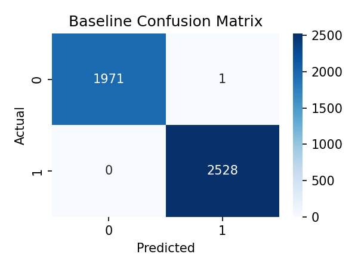

**Figure 4. Black-Box Confusion Matrix**

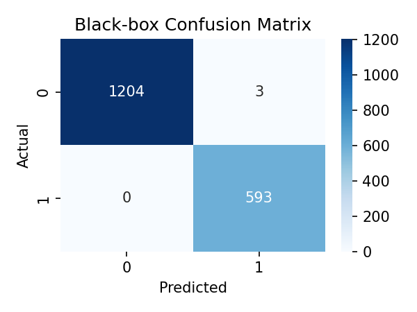

Security interpretation:

- **FP impact:** analyst overload, potential business disruption from unnecessary response.  
- **FN impact:** delayed containment and increased compromise dwell time.

### 4.3 SHAP and LIME Analysis

**Figure 5. SHAP Summary Plot**

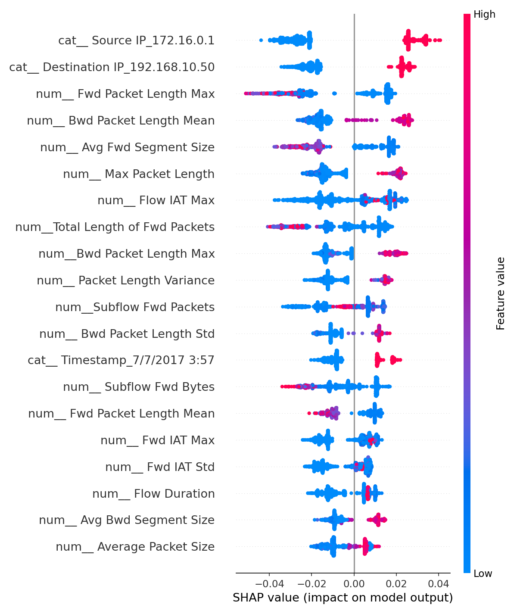

Representative top global features from the SHAP importance outputs include:

- `cat__ Destination IP_192.168.10.50`,  
- `num__ Avg Fwd Segment Size`,  
- `num__ Fwd IAT Std`,  
- `num__ Packet Length Variance`.

### 4.4 Local Explanation Case Studies (5 SOC Cases)

**Figure 6. SHAP Waterfall (sample_id=0, TN)**  
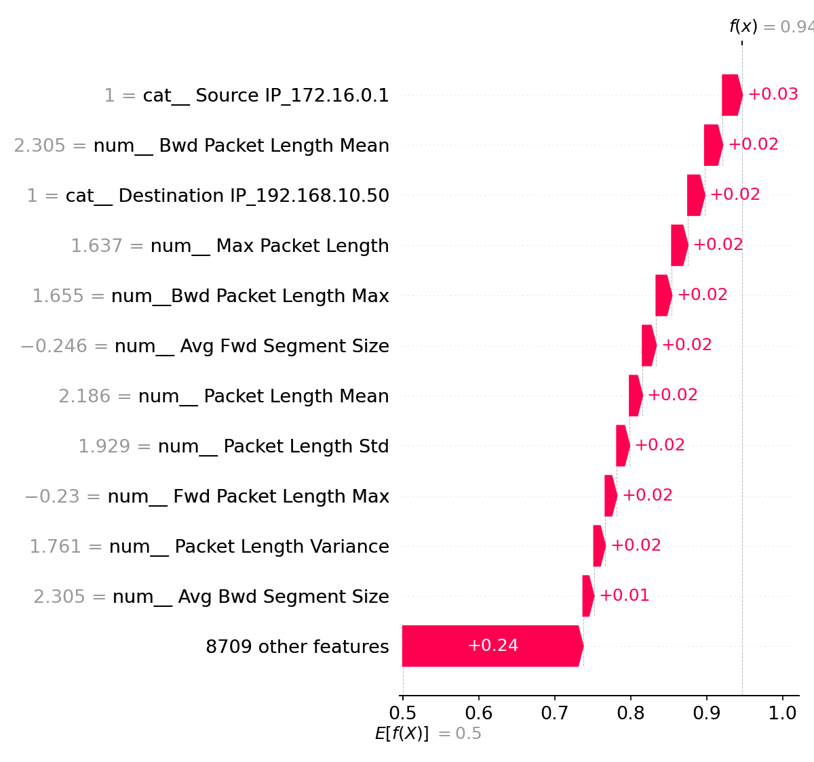

**Figure 7. SHAP Waterfall (sample_id=1, TP)**  
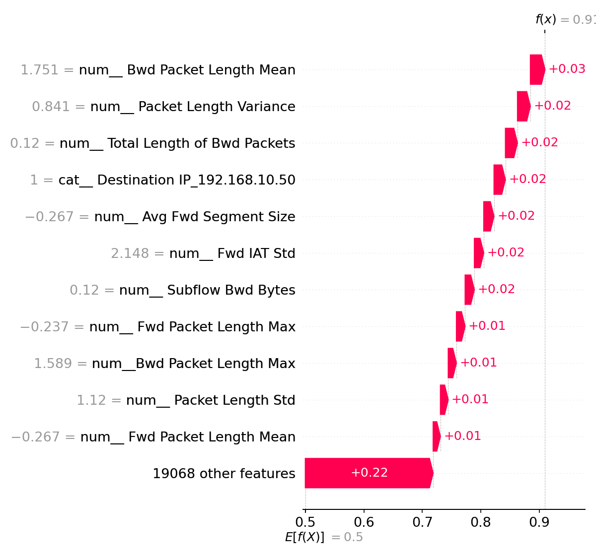

**Figure 8. SHAP Waterfall (sample_id=2, TP)**  
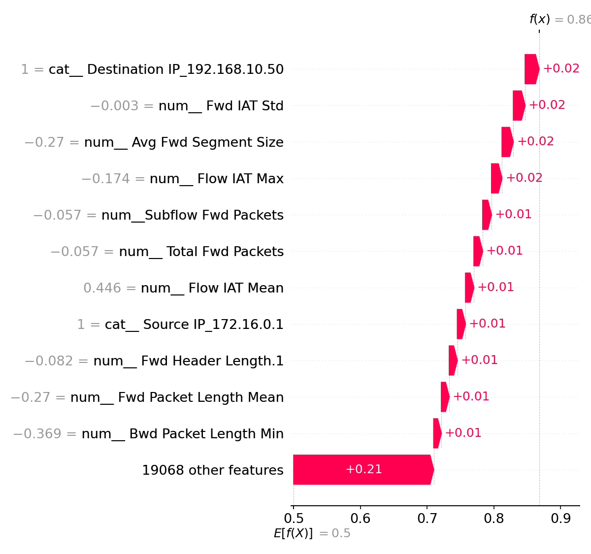

**Figure 9. SHAP Waterfall (sample_id=16, FP)**  
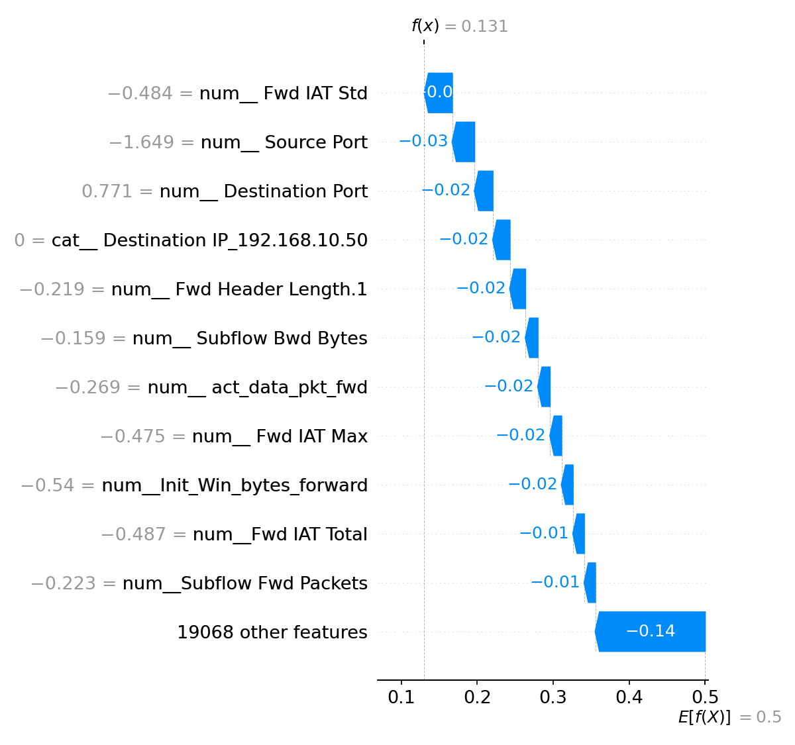

**Figure 10. SHAP Waterfall (sample_id=125, FN)**  
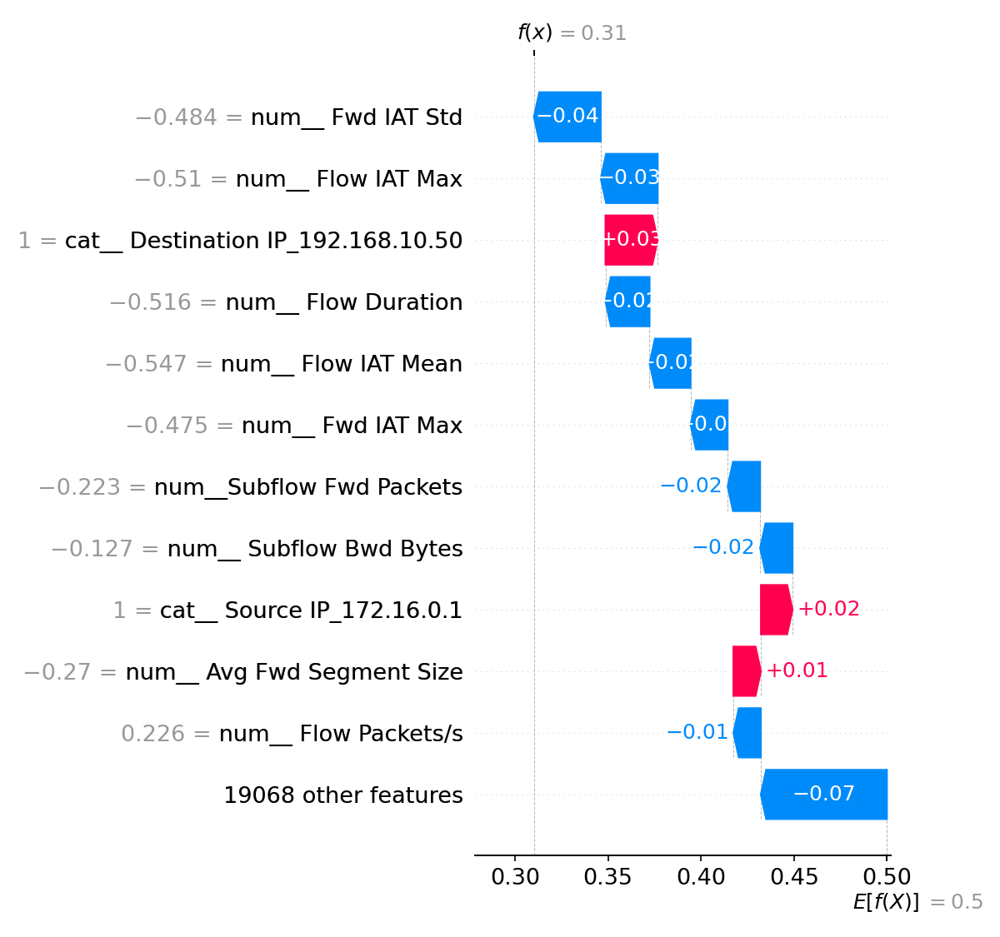

FP interpretation example (sample_id=16): key local SHAP drivers include flow timing and port-related features (`Fwd IAT Std`, `Source Port`, `Destination Port`), while LIME emphasizes rule-form one-hot conditions. This mismatch should be disclosed as a method-level representation gap, not a contradiction in model logic.

### 4.5 SHAP-LIME Agreement and Analyst Utility

From the run-level summary outputs:

| Metric | Value |
|---|---:|
| ExplanationCoverage | 1.0 |
| TopKAgreement | 0.0 |
| ActionabilityScore | 0.8 |
| FPReviewEfficiency | 0.4 |

The current TopKAgreement is low because SHAP uses transformed feature names while LIME outputs rule strings, so direct lexical overlap is limited.

### 4.6 Overfitting Diagnostics

Source: overfitting diagnostic outputs from the frozen experiment run.

| Model | Split | F1 |
|---|---|---:|
| baseline | train | 1.00000 |
| baseline | val | 1.00000 |
| baseline | test | 0.99980 |
| blackbox | train | 0.99941 |
| blackbox | val | 0.99960 |
| blackbox | test | 0.99881 |

**Figure 11. F1 by Split**

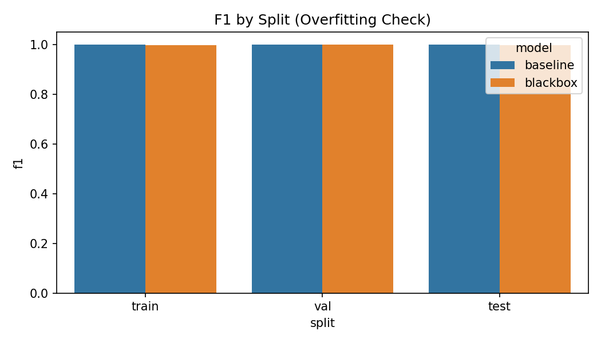

Observed split gaps are small, but the report should explicitly note that train/val/test all come from closely related distribution slices, which can overestimate production generalization.

---

## 5. Organisational Deployment Strategy, Ethics, and Future Work

### 5.1 Deployment Strategy

Suggested deployment architecture:

1. ingest flow telemetry into SIEM/SOAR pipeline,  
2. run scoring service with fixed model version and threshold,  
3. enrich high-risk alerts with SHAP/LIME evidence and casebook recommendations,  
4. apply human-in-the-loop triage for suppression/escalation decisions.

### 5.2 Key Limitations

1. **Adversarial exposure risk:** explanation surfaces can be exploited for evasion crafting.  
2. **Concept drift risk:** CICIDS static snapshots may not represent evolving enterprise traffic.  
3. **Representation mismatch:** SHAP and LIME output formats limit direct comparability.  
4. **Identity-heavy features:** one-hot endpoint features may reduce portability and raise privacy concerns.

### 5.3 Ethics and Compliance

- enforce human oversight for high-impact response actions,  
- minimize sensitive fields and adopt pseudonymization where feasible,  
- retain model version, threshold, and explanation artifacts for auditability.

### 5.4 Future Work

1. add temporal split and drift monitoring for stronger operational validity,  
2. build feature-semantic mapping layer to harmonize SHAP and LIME for analyst reporting,  
3. evaluate low-latency explanation strategies for near-real-time SOC use.

---

## References

1. Lundberg, S. M., & Lee, S.-I. (2017). *A Unified Approach to Interpreting Model Predictions*. NeurIPS.  
2. Ribeiro, M. T., Singh, S., & Guestrin, C. (2016). *Why Should I Trust You? Explaining the Predictions of Any Classifier*. KDD.  
3. Canadian Institute for Cybersecurity. CICIDS2017 Dataset Documentation. [https://www.unb.ca/cic/datasets/ids-2017.html](https://www.unb.ca/cic/datasets/ids-2017.html)  
4. Pedregosa, F., et al. (2011). *Scikit-learn: Machine Learning in Python*. JMLR.

---

## Colab and Submission Checklist

| Item | Status |
|---|---|
| Notebook uploaded and runnable end-to-end | ☐ |
| All output cells visible | ☐ |
| Public viewer link enabled | ☐ |
| Link verified in incognito mode | ☐ |
| Link inserted on PDF cover page | ☐ |
| Final PDF within page-limit requirement | ☐ |

